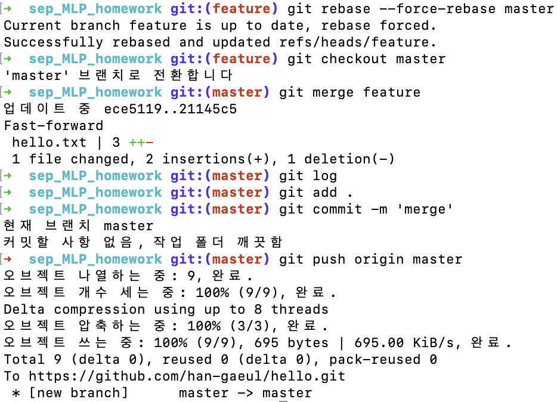

### `Git & Github 실무 활용`

***

#### 💻 [Github 과제 링크](https://github.com/han-gaeul/hello)


#### 💻 Code

```python
# 저장소 생성
git init

# 원격 저장소 연결
git remote add origin https://github.com/han-gaeul/hello.git
  
# 브랜치 master에 'hello.txt' 파일 생성
(master) touch hello.txt

# 파일 생성 커밋
(master) git add .
(master) git commit -m 'create:hello.txt'

# 새로운 브랜치 생성
(master) git branch feature

# 브랜치 master에서 'hello.txt' 파일 수정 후 커밋
(master) git add .
(master) git commit -m 'edit:hello.txt'

# 브랜치 이동
(feature) git checkout feature

# 브랜치 feature에서 'hello.txt' 파일 수정 후 커밋
(feature) git add .
(feature) git commit -m '[feature] edit:hello.txt'

# 브랜치 master와 rebase
(feature) git rebase master

# 'Current branch feature is up to date' 메시지가 나옴
# 구글링으로 해결 방법 찾던 도중 강제로 rebase 하는 방법을 찾음
(feature) git rebase --forse-rebase master

# 브랜치 master에 브랜치 feature 병합
(master) git checkout master
(master) git merge feature

# 커밋 후 원격 저장소에 push
(master) git add .
(master) git commit -m 'merge'
(master) git push origin master
```



